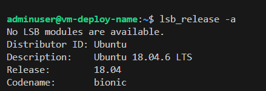

# VM-terraform-azure-modules

Este proyecto se basa en un proyecto inicial que configura diversos recursos en Azure, como subnets y grupos de seguridad. En lugar de explicar nuevamente esa configuración, este proyecto se centra en modularizar la creación de máquinas virtuales. Para una explicación detallada del proyecto original, visita el repositorio en GitHub [VM-terraform-azure](https://github.com/DanielRamirez1901/VM-terraform-azure).

## Requisitos 🎯

Para este proyecto necesitaras

- Visual Studio Code
- Terraform instalado en tu maquina
- Cuenta de azure

Nota: Ten en cuenta que algunos archivos no se encuentran debido al .gitignore, algunos de estos son por ejemplo el terraform.tfvars, terraform.tfstate, etc, algunos de estos se generan automaticamente mientras que otros manualmente, los que se realizaron manualmente se encuentran en la documentacion de este proyecto

## Pasos a seguir para la configuracion del despliegue 📖

Primero, crearemos las clases necesarias para el proyecto, debe tener el siguiente esquema

    ├── modules
    │   ├── virtual-machine
    │   │   ├── main.tf
    │   │   ├── outputs.tf
    │   │   └── variables.tf
    ├── main.tf
    ├── terraform.tfvars
    └── variables.tf

En la clase de virtual machine debe ir lo siguiente

## main.tf

Esta clase tendra lo siguiente

```
resource "azurerm_linux_virtual_machine" "vm" {
    name                  = var.vmname
    resource_group_name   = var.resource_group_name
    location              = var.location
    size                  = var.vm_size
    admin_username        = var.admin_usename
    network_interface_ids = var.network_interface_ids

    admin_ssh_key {
        username   = "adminuser"
        public_key = file("~/.ssh/vm-deploy-key.pub")
    }
    os_disk {
        name                    = "${var.vmname}-os-disk-01"
        caching                 = "ReadWrite"
        storage_account_type    = var.os_disk_type
    }
    source_image_reference {
        publisher = var.image_publisher
        offer     = var.image_offer
        sku       = var.image_sku
        version   = "latest"
    }

    tags = {
        environment = "dev"
    }
}
```

En esta clase, se definen los valores que tomara la maquina virtual, como su red, su nombre de usuario, el ssh entre otros

## outputs.tf

En esta clase se debe colocar el nombre del recurso de linux

```
output "vm_id" {
    description = "id of the fileshare"
    value = azurerm_linux_virtual_machine.vm.id
}
```

## variables.tf

Aqui podemos definir todas las variables necesarias para poderlas usar en el main general del proyecto y las cuales usa el main tf de modules

```
variable "vmname" {
    type = string
    description = "The name of the virtual machine"
}
variable "resource_group_name" {
    type = string
    description = "The name of resource group"
}
variable "location" {
    type = string
    description = "Azure location "
}
variable "network_interface_ids" {
    type = list(string)
    description = "network interface id"
}
variable "vm_size" {
    type = string
    description = "size of the virtual machine"
}
variable "os_disk_type" {
    type = string
    description = "type of the os disk. example Standard_LRS"
}
variable "admin_usename" {
    type = string
    description = "local admin user of the virtual machine"
}
variable "image_publisher" {
    type = string
    description = "Azure image publisher"
}
variable "image_offer" {
    type = string
    description = "Azure image offer"
}
variable "image_sku" {
    type = string
    description = "Azure image sku"
}
```

## main.tf general

En este apartado, debemos cambiar solo la parte de la creacion de la maquina virtual para que se use la creacion de la vm del modulo

```
module "vm-deploy-vm" {
  source                = "./modules/virtual-machine"
  vmname                = var.vmname
  location              = azurerm_resource_group.vm-deploy-rg.location
  resource_group_name   = azurerm_resource_group.vm-deploy-rg.name
  network_interface_ids = [azurerm_network_interface.vm-deploy-nic.id]
  vm_size               = var.vm_size
  os_disk_type          = var.os_disk_type
  admin_usename         = var.admin_usename
  image_publisher       = var.image_publisher
  image_offer           = var.image_offer
  image_sku             = var.image_sku
}
```

## variables.tf

Aqui tambien se deben definir las variables que seran pasadas al modulo para poderles darles un valor en terraform.tfvars

```
variable "prefix" {
  type        = string
  description = "Prefix for resource names"
}

variable "name_function" {
  type        = string
  description = "Name of the function"
}

variable "location" {
  type        = string
  description = "Location for the Azure resources"
}

variable "vm_size" {
  type        = string
  description = "size of the virtual machine"
}
variable "os_disk_type" {
  type        = string
  description = "type of the os disk. example Standard_LRS"
}
variable "admin_usename" {
  type        = string
  description = "local admin user of the virtual machine"
}
variable "image_publisher" {
  type        = string
  description = "Azure image publisher"
  default     = "Canonical"
}
variable "image_offer" {
  type        = string
  description = "Azure image offer"
  default     = "UbuntuServer"
}
variable "image_sku" {
  type        = string
  description = "Azure image sku"
  default     = "18.04-LTS"
}
variable "vmname" {
  type        = string
  description = "name of the vm"
}
```

## terraform.tfvars

Ahora, le damos valore sa todas las variables que estamos usando para la creacion de los recursos

```
name_function = "vm-deploy"
location      = "East US"
prefix        = "vm"
vmname        = "vm-deploy-name"
vm_size       = "Standard_B1s"
os_disk_type  = "Standard_LRS"
admin_usename = "adminuser"
```

# Deployment

Ahora, podemos ver toda la implementacion, primero, vemos como el terraform plans y apply son exitosos

<p align="center">
  
</p>
<p align="center">
  
</p>
<p align="center">
  
</p>
<p align="center">
  
</p>

Ahora, podemos ingresar por medio de ssh primero viendo la ip publica del recurso que tiene creada la maquina virtual

<p align="center">
  
</p>

<p align="center">
  
</p>

Ahora, ingresamos por ssh

<p align="center">
  
</p>

<p align="center">
  
</p>

Ahora, por ultimo, podemos ver todos los recursos creados en azure

<p align="center">
  
</p>

## Realizado por 😎

- **Daniel Ramirez - A00368788**
  - GitHub: [Danilops](https://github.com/DanielRamirez1901)
